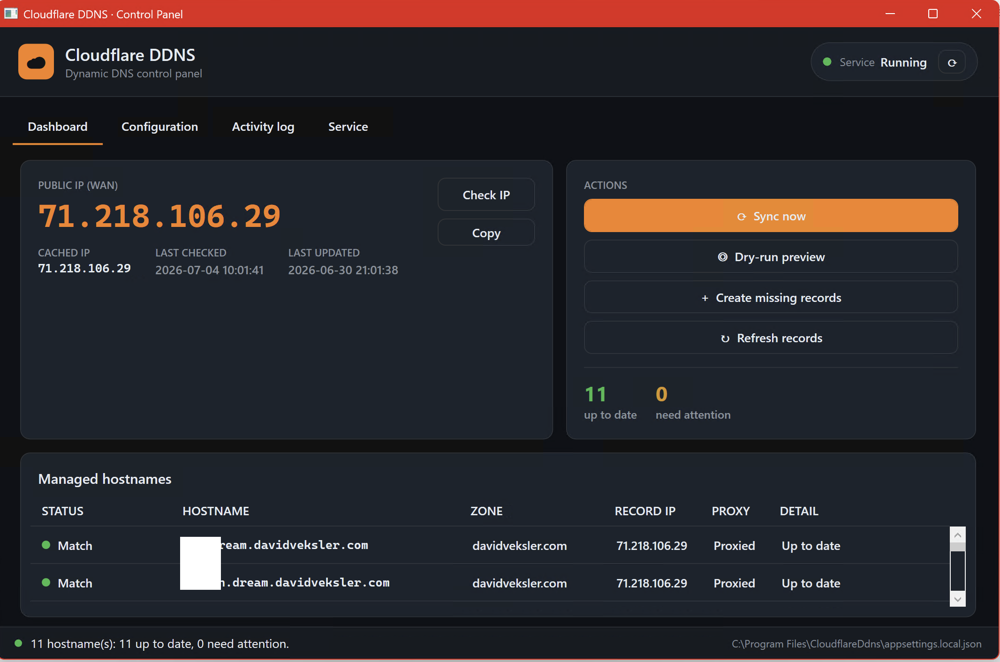
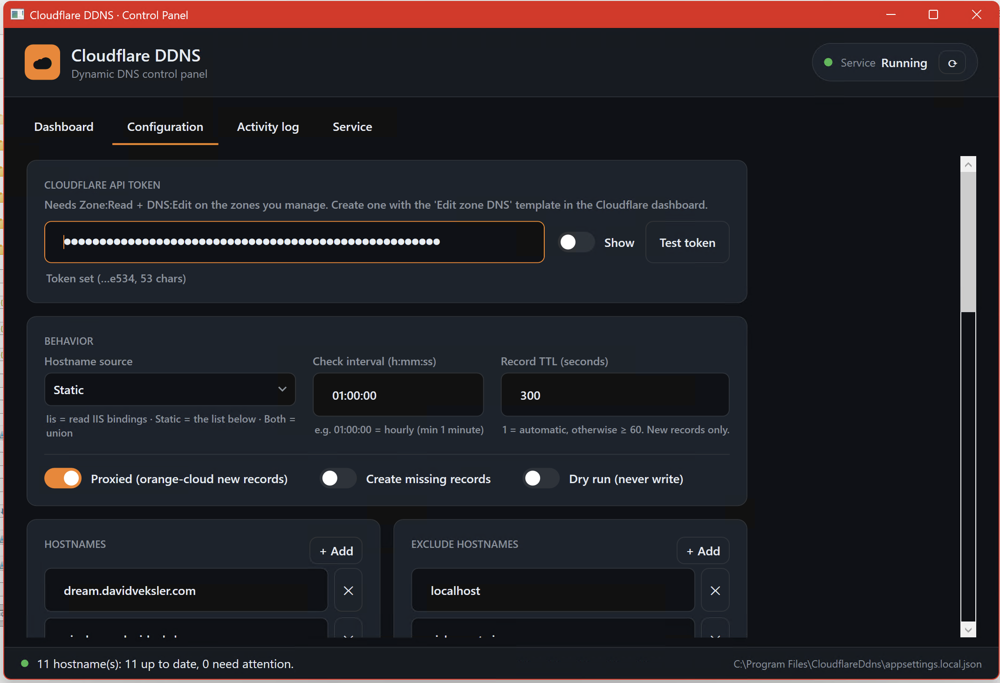
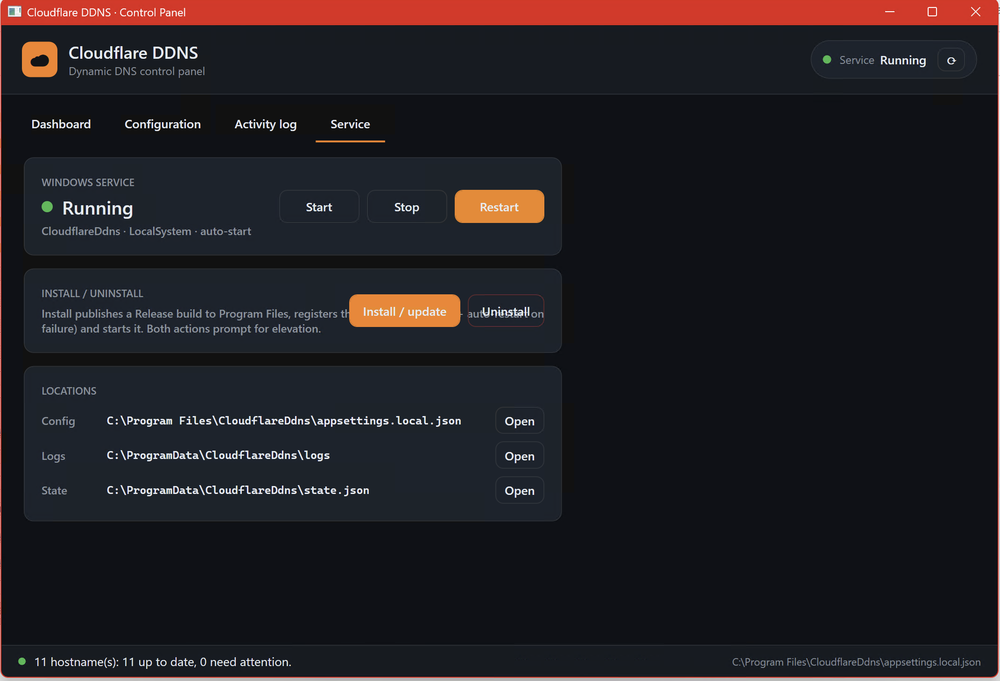

# CloudflareDdns

**Cloudflare Dynamic DNS (DDNS) for Windows** — a free, self-hosted **Windows Service** written in
**C# / .NET 8** that keeps your **Cloudflare DNS A records** pointed at your home or office's current
public IP. A free, self-hosted replacement for the **Dynu DDNS service + Dynu IP Update Client**.

Every hour it:

1. Resolves this machine's current **public IPv4** (your Quantum Fiber WAN address) from external
   "what's my IP" providers, with fallback.
2. Discovers the **hostnames to manage** — read from your **IIS site bindings** (host headers) and/or a
   static list in config.
3. For each hostname, finds the owning **Cloudflare zone** and updates the **A record** to your current
   IP (only when it actually changed).
4. **Logs** everything to a rolling file and the Windows Event Log so you can monitor it.

It only ever talks to Cloudflare when your IP changes, so it's gentle on the API.

There are two ways to drive it:

- **The Windows Service** — the headless background worker described below (`install.ps1`).
- **The Control Panel** — a **WPF desktop GUI** (`gui/`) for configuring, monitoring, and running it by hand.

---

## Desktop control panel (GUI)

A dark-themed WPF app in [`gui/`](gui/) that reuses the **exact same sync services** the Windows
Service runs — so a "Sync now" or "Dry-run" from the GUI takes the identical code path as the
scheduled service, and its Serilog output streams live into the app.

```powershell
.\run-gui.ps1                 # build + launch (Debug)
.\run-gui.ps1 -Configuration Release
# or:  dotnet run --project gui/CloudflareDdns.Gui.csproj
```

It has four tabs:

| Tab | What it does |
|-----|--------------|
| **Dashboard** | Big public-IP readout, cached IP + last-checked/updated timestamps, and a live table of every managed hostname → owning zone → current Cloudflare A record, color-coded *up to date / mismatch / missing*. Buttons: **Check IP**, **Sync now**, **Dry-run preview**, **Refresh records**. |
| **Configuration** | Full UX for the config (see below) — API token (masked, with a **Test token** button that lists visible zones), interval, hostname source, TTL, the Proxied / Create-missing / Dry-run toggles, and add/remove editors for hostnames, excludes, and IP providers. Plus an **Advanced** expander to edit the raw `appsettings.json` / `appsettings.local.json` with JSON validation. |
| **Activity log** | Live, color-coded Serilog stream of every operation, mirrored to `C:\ProgramData\CloudflareDdns\logs\gui-*.log`. |
| **Service** | Shows the `CloudflareDdns` service status and **Start / Stop / Restart / Install / Uninstall** (each prompts for elevation via UAC), plus quick "Open folder" shortcuts for the config, logs, and state file. |

<p align="center">
  
  
  
</p>

**Config UX:** the editor loads the *effective* merged config and writes your changes to
`appsettings.local.json` (the git-ignored override file where secrets belong). After saving, restart
the service to apply. The GUI reads/writes config from the **installed** service folder when present,
otherwise from its own folder — the active path is always shown in the status bar.

> Runs un-elevated so you can watch status at a glance; it only asks for admin when you actually
> start/stop/install the service.

---

## How it works

```
PeriodicTimer (hourly + on startup)
        │
        ▼
   DdnsUpdater.RunOnceAsync
        │
        ├── PublicIpProvider   → ipify / aws / icanhazip / ifconfig.me  (first valid IPv4 wins)
        ├── HostnameProvider   → IIS bindings (Microsoft.Web.Administration) and/or static list
        ├── StateStore         → skip everything if IP == last cached IP
        └── CloudflareClient   → list zones → match hostname → GET A record → PUT if different
```

| Concern        | Where                                                            |
|----------------|-----------------------------------------------------------------|
| Config         | [`appsettings.json`](appsettings.json) → `Ddns` section          |
| Logs (file)    | `C:\ProgramData\CloudflareDdns\logs\ddns-*.log` (30-day rolling) |
| Logs (events)  | Windows **Event Viewer → Application**, source `CloudflareDdns`  |
| Last-known IP  | `C:\ProgramData\CloudflareDdns\state.json`                       |

---

## Setup

### 1. Get a Cloudflare API token

Dashboard → **My Profile → API Tokens → Create Token**. Use the **Edit zone DNS** template, scoped to
the zone(s) you want managed. The token needs:

- **Zone → Zone → Read**
- **Zone → DNS → Edit**

### 2. Configure

Put your **secrets and personal hostnames** in a local override file that is **git-ignored**, so they
never end up in source control. Copy the example and edit it:

```powershell
Copy-Item appsettings.local.example.json appsettings.local.json
```

```jsonc
// appsettings.local.json  (git-ignored; overrides appsettings.json)
"Ddns": {
  "ApiToken": "your-cloudflare-token",
  "HostnameSource": "Static",      // Iis | Static | Both
  "Hostnames": [ "home.example.com" ], // used for Static / Both
  "ExcludeHostnames": [ "localhost" ],
  "Proxied": true,                 // true = orange-cloud the records
  "CreateIfMissing": false         // true = create A records that don't exist yet
}
```

The committed [`appsettings.json`](appsettings.json) holds the non-secret defaults (interval, IP
providers, logging) and placeholders. Anything in `appsettings.local.json` wins.

> **Alternative:** set just the token via a machine env var instead of the file:
> `setx Ddns__ApiToken "your-token" /M`.

**Config keys:** `Interval` (TimeSpan, default `01:00:00`), `HostnameSource` (`Iis`/`Static`/`Both`),
`Hostnames`, `ExcludeHostnames`, `Proxied`, `CreateIfMissing`, `DryRun`. `Proxied`/`RecordTtl` apply
only to records the service *creates* — updates change just the IP and preserve the record's existing
proxy flag and TTL.

### 3. Install the service

From an **elevated** PowerShell prompt in this folder:

```powershell
.\install.ps1
```

This publishes to `C:\Program Files\CloudflareDdns`, registers the service (auto-start, auto-restart on
failure), and starts it. After editing config later:

```powershell
Restart-Service CloudflareDdns
```

### 4. Verify

```powershell
Get-Service CloudflareDdns
Get-Content 'C:\ProgramData\CloudflareDdns\logs\ddns-*.log' -Tail 30 -Wait
```

You should see lines like:

```
Managing 2 hostname(s): www.example.com, api.example.com
Public IP is 75.x.x.x (was unknown); reconciling 2 hostname(s).
Updated A record www.example.com: 75.y.y.y -> 75.x.x.x (zone example.com).
```

---

## Dry run — preview changes safely

Before letting it touch your DNS, do a read-only preview. With a **real API token** set, run:

```powershell
dotnet run -c Release -- --dry-run
```

It does **one** pass and exits, logging exactly what it would do without writing anything to Cloudflare:

```
[DRY RUN] No changes will be written to Cloudflare.
Managing 2 hostname(s): www.example.com, api.example.com
Public IP is 71.x.x.x; reconciling 2 hostname(s).
[DRY RUN] Would update A record www.example.com: 71.y.y.y -> 71.x.x.x (zone example.com).
A record api.example.com already points to 71.x.x.x (zone example.com); no change.
[DRY RUN] Reconcile preview complete: 1 record(s) would change.
```

This is the safe way to verify your IIS→zone→record matching is correct. Dry-run bypasses the
"IP unchanged" shortcut so it always shows the full mapping, and it never advances the cached IP.
You can also set `"DryRun": true` in `appsettings.json` (e.g. to install the service in preview mode).

## Run in the foreground (debugging)

You can run it as a normal console app without installing the service:

```powershell
dotnet run -c Release
```

With the placeholder token still in place it will fail fast with a clear config error — that's expected.

## Uninstall

```powershell
.\uninstall.ps1            # remove the service
.\uninstall.ps1 -RemoveFiles   # also delete binaries + data/logs
```

---

## Notes & behavior

- **IIS discovery** reads host headers from every site binding. Bindings with no host header (IP-only),
  wildcards (`*.example.com`), and single-label names (`localhost`) are skipped automatically.
- A hostname is only updated if a **Cloudflare zone you can see owns it**. Unowned hostnames are logged
  and skipped, never created (unless `CreateIfMissing` is on).
- If a run **partially fails**, the cached IP is *not* advanced, so the next hourly run retries the
  failed hosts instead of assuming everything is current.
- IPv4 only (A records). AAAA/IPv6 isn't handled.
- Requires the service account (LocalSystem by default) to be able to read IIS config — LocalSystem can.

---

## License

[MIT](LICENSE) © David Veksler
